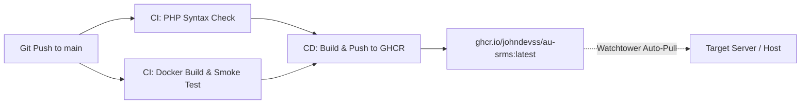

# Student Result Management System

[](https://github.com/johndevss/au-srms/actions/workflows/ci.yml)
[](https://github.com/johndevss/au-srms/actions/workflows/deploy.yml)


A web-based **Student Result Management System (SRMS)** developed as a Senior High School capstone project.  
The system centralizes student academic records, allowing administrators and teachers to manage grades efficiently while enabling students to securely view their results online.

---

## Project Overview

This project was created to solve a real problem experienced during Senior High School, where student grades were distributed through messaging apps as images—an inefficient and insecure approach.

The **Student Result Management System** provides:

- Centralized student record management
- Role-based access (Admin, Teacher, Student)
- Online grade viewing
- Basic academic data organization by strand and section

---

## Objectives

- Replace manual or image-based grade distribution
- Improve accessibility of student academic records
- Reduce errors in grade handling
- Provide a simple and structured academic management system for schools

---

## Technologies Used

- **Frontend:**

  - HTML
  - CSS

- **Backend:**

  - PHP (Procedural)

- **Database:**

  - MySQL (phpMyAdmin / XAMPP)

- **Server Environments:**
  - Local: PHP CLI / XAMPP / Built-in Server + MySQL
  - Container / Production: Docker & Docker Compose (Nginx + PHP 8.4-FPM + MySQL 8.0)

---

## User Roles

### Administrator

- Manage users (teachers and students)
- Manage subjects and sections
- View class lists
- Oversee the entire system

### Teacher

- Manage assigned students
- Input and update student grades
- View class records

### Student

- Log in securely
- View personal academic results
- Access announcements

---

## Getting Started & Setup

### Prerequisites

- **For Local Development:**
  - PHP 8.0 or higher (with `mysqli` extension enabled)
  - Composer
  - MySQL / MariaDB (e.g., via XAMPP, Laragon, or standalone)
- **For Container / Production (Docker):**
  - Docker & Docker Compose

---

### Environment Configuration (`.env`)

Create a `.env` file in the root directory:

```env
DB_HOST=127.0.0.1
DB_PORT=3306
DB_DATABASE=au_srms
DB_USERNAME=root
DB_PASSWORD=
```

*(Note: When running with Docker Compose, `DB_HOST` is automatically resolved as `mysql` across containers).*

---

### Option 1: Local Development (PHP CLI / Built-in Server)

1. **Clone the repository:**
   ```bash
   git clone https://github.com/<your-username>/au-srms.git
   cd au-srms
   ```

2. **Install Composer dependencies:**
   ```bash
   composer install
   ```

3. **Set up the database:**
   - Create a MySQL database named `au_srms`:
     ```sql
     CREATE DATABASE au_srms CHARACTER SET utf8mb4 COLLATE utf8mb4_general_ci;
     ```
   - Import the database schema and seed data:
     ```bash
     mysql -u root -p au_srms < database/au-srms.sql
     ```

4. **Configure your `.env`:**
   - Set `DB_HOST=127.0.0.1` (or `localhost`) and match your local database credentials.

5. **Start PHP built-in web server:**
   Point the document root to the `public/` folder:
   ```bash
   php -S localhost:8000 -t public
   ```

6. **Access the application:**
   Open your browser at `http://localhost:8000`.

---

### Option 2: Docker Environment (FrankenPHP + MySQL)

The repository provides a modern, containerized stack:
- **`app`**: Standalone FrankenPHP (PHP 8.4) serving HTTP directly on `${APP_PORT:-8080}` (ready for centralized reverse-proxying with Nginx).
- **`mysql`**: MySQL 8.0 database service automatically initialized and seeded with `database/au-srms.sql`.

#### Steps to Run:

1. **Configure Environment Variables:**
   ```bash
   cp .env.example .env
   ```

2. **Build and start containers:**
   ```bash
   docker compose up -d --build
   ```

   *During the first startup, composer dependencies are automatically installed, and MySQL automatically loads `database/au-srms.sql` to initialize tables and seed records.*

3. **Verify running containers:**
   ```bash
   docker compose ps
   ```

4. **Access the application:**
   Open your browser at:
   ```
   http://localhost:8080
   ```

5. **Stopping the containers:**
   ```bash
   # Stop containers
   docker compose down

   # Stop and delete database volumes (resets database)
   docker compose down -v
   ```

---

## CI/CD & Automated Deployment Architecture



1. **Continuous Integration (`ci.yml`)**:
   - Validates Composer dependencies and lockfile consistency.
   - Runs static PHP syntax checks across all controllers, views, and database layers (`php -l`).
   - Builds the Docker stack and performs automated HTTP smoke testing against the live container.
2. **Continuous Deployment (`deploy.yml`)**:
   - Builds a self-contained production image.
   - Pushes the image to **GitHub Container Registry (GHCR)** tagged with `:latest` and the commit SHA.
3. **Automated Server Updates (GitOps / Watchtower)**:
   - Target host servers running [Watchtower](https://containrrr.dev/watchtower/) automatically detect new image tags in GHCR and rolling-restart the container with zero manual intervention.

---

### Default Demo Credentials

The initial seed in `database/au-srms.sql` provides the following mock accounts:

| Role | Username | Password |
|---|---|---|
| **Administrator** | `admin` | `admin123` |
| **Faculty / Teacher** | `faculty` | `faculty123` |
| **Student** | `student` | `student123` |

---

## Project Structure

```text
au-srms/
├── app/
│   ├── Controllers/     # Request handling & backend controllers
│   └── Views/           # View templates (admin, teacher, student)
├── database/
│   ├── config.php       # Database connection handler
│   └── au-srms.sql      # Database schema and seed data
├── public/              # Web server document root (index.php, CSS, images)
│   ├── assets/
│   └── index.php
├── Dockerfile           # PHP 8.4 FPM Docker image definition
├── docker-compose.yml   # Multi-container orchestration (Nginx, PHP, MySQL)
├── nginx.conf           # Nginx server block configuration
├── composer.json        # PHP dependencies (vlucas/phpdotenv)
└── README.md
```
